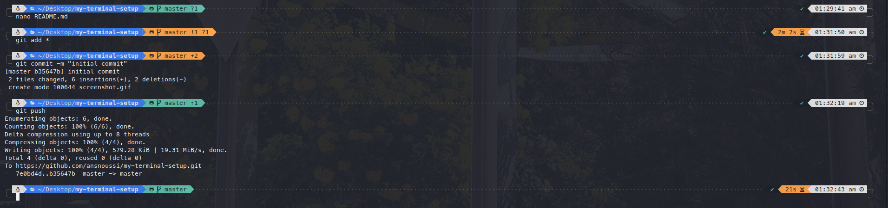

# My Terminal Setup
this repo is for the config I use in my terminal, shell, themes, plugins ....

## My current setup
## New

## Old

## What I'm using

* ZSH : highly customisable shell.
* [Oh My Zsh](https://github.com/ohmyzsh/ohmyzsh) : framework for managing your zsh configuration with sevral plugins and themes.
* [Powerlevel10k](https://github.com/romkatv/powerlevel10k) : theme that not only looks cool, but great help when dealing with git repos < br/>
example:

* [FZF](https://github.com/junegunn/fzf) A command-line fuzzy finder
* [Tmux](https://github.com/tmux/tmux/wiki) A terminal multiplexer
