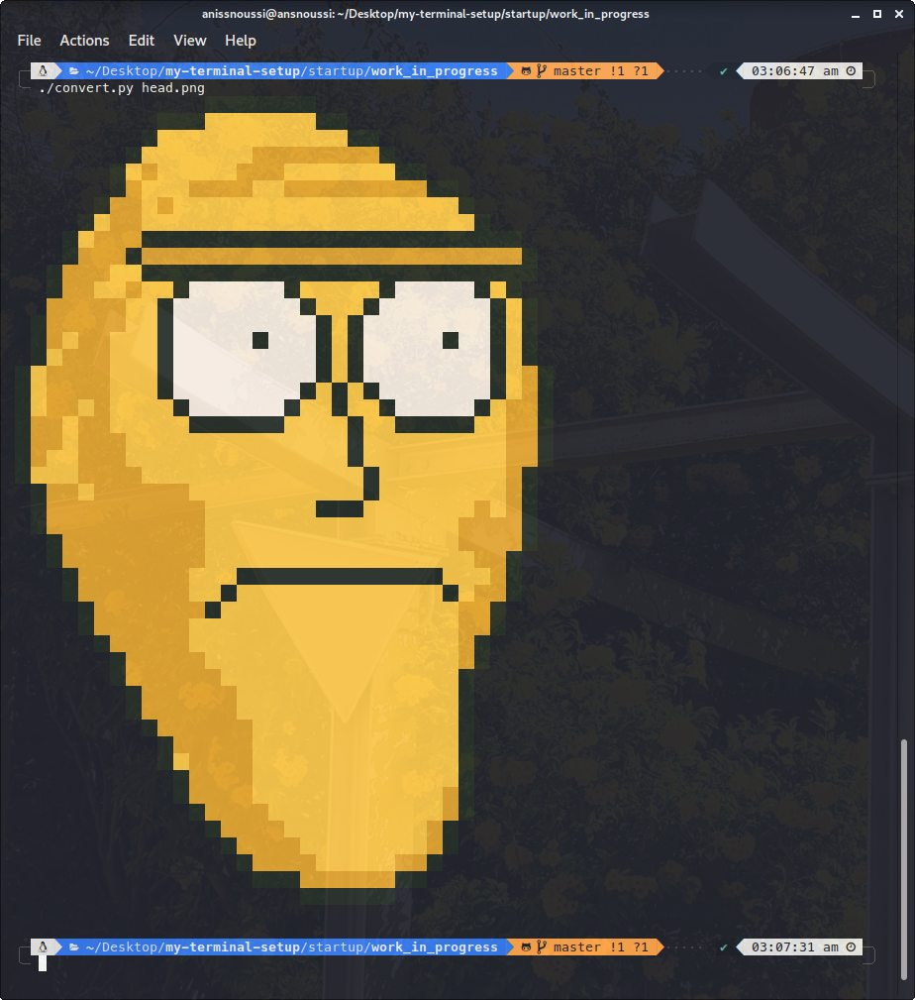
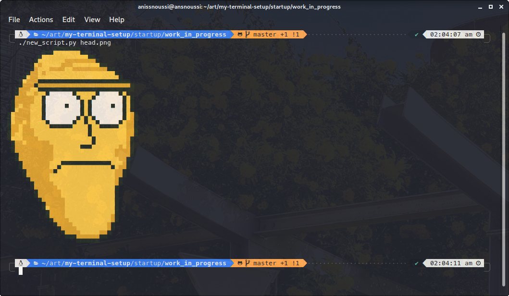

## ToDo
- [x] redraw a small version of the head 
- [x] write a script to turn it into ANSI art
- [ ] <del>enjoy</del>
- [x] look for a way to make it smaller
- [x] use these special carc to minimize the size 4 times: "▄","▀"
- [x] enjoy
- [x] wait, just add the text now !
- [x] enjoy

## result

## Old

## New

